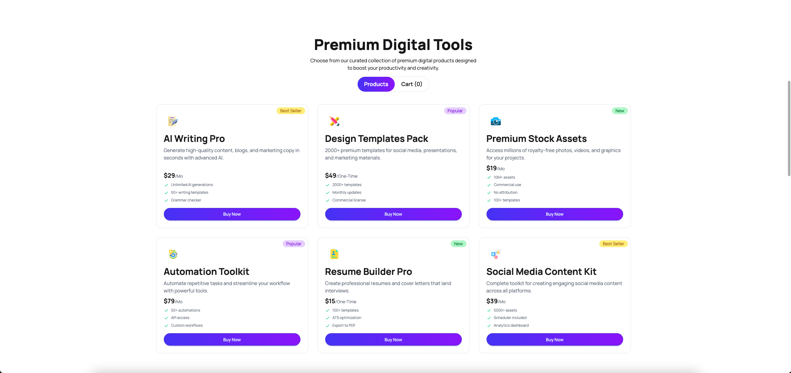

# DigiTools Platform

A modern React-based landing page for a digital tools marketplace. The app showcases premium digital products, includes a responsive shopping cart experience, pricing plans, and visual storytelling sections for fast product discovery.



---

## Overview

DigiTools Platform is a frontend demo built with React and Vite, designed to highlight premium digital products and make it easy for users to browse, add items to cart, and simulate checkout. The app is styled with TailwindCSS and DaisyUI, with product and pricing content loaded from local JSON files.

---

## Technologies Used

- Frontend Framework: React 19
- Build Tool: Vite
- Styling: Tailwind CSS 4
- UI Components: DaisyUI
- Icons: Lucide React
- Notifications: React Toastify
- Linting: ESLint

---

## Main Features

- Responsive landing page with hero section, product showcase, stats, pricing, and call-to-action sections.
- Product browsing interface with category toggle and dynamic product cards.
- Shopping cart support with item count badge, cart view, remove item, and checkout interaction.
- Toast notifications for cart actions and checkout flow.
- Pricing section with plan cards loaded from `pricing.json`.
- Smooth responsive layout for desktop and mobile screens.

---

## Dependencies

- `react`
- `react-dom`
- `vite`
- `@vitejs/plugin-react`
- `tailwindcss`
- `@tailwindcss/vite`
- `daisyui`
- `lucide-react`
- `react-toastify`
- `eslint`
- `@eslint/js`
- `eslint-plugin-react-hooks`
- `eslint-plugin-react-refresh`
- `@types/react`
- `@types/react-dom`
- `globals`

---

## Run Locally

1. Clone the repository:

   ```bash
   git clone https://github.com/rakib4kbd/B13-A6-DigiTools-Platform.git
   cd B13-A6-DigiTools-Platform
   ```

2. Install dependencies:

   ```bash
   npm install
   ```

   or if you use pnpm:

   ```bash
   pnpm install
   ```

3. Start the development server:

   ```bash
   npm run dev
   ```

   or with pnpm:

   ```bash
   pnpm dev
   ```

4. Open the local URL shown in the terminal (usually `http://localhost:5173`).

---

## Available Scripts

- `npm run dev` — start Vite development server
- `npm run build` — build production files
- `npm run preview` — preview the production build locally
- `npm run lint` — run ESLint checks

---

## Live Demo & Relevant Links

- Live Demo: `https://rakib4kbd.dev/B13-A6-DigiTools-Platform/`
- GitHub Link: `https://github.com/rakib4kbd/B13-A6-DigiTools-Platform`

---

## Notes

This project is frontend-only. It uses static JSON data for product and pricing content, so no backend is required to run the demo locally.
